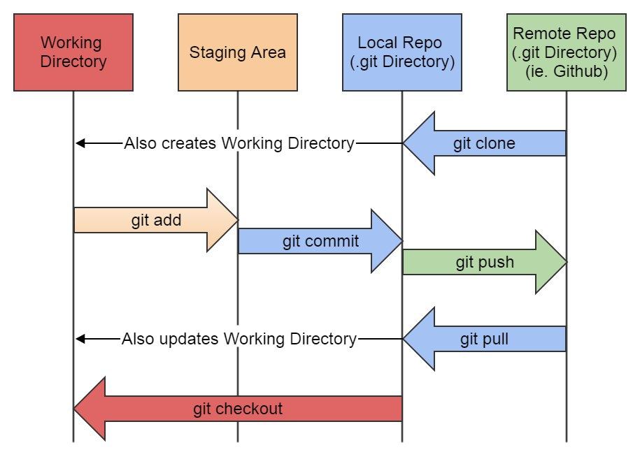
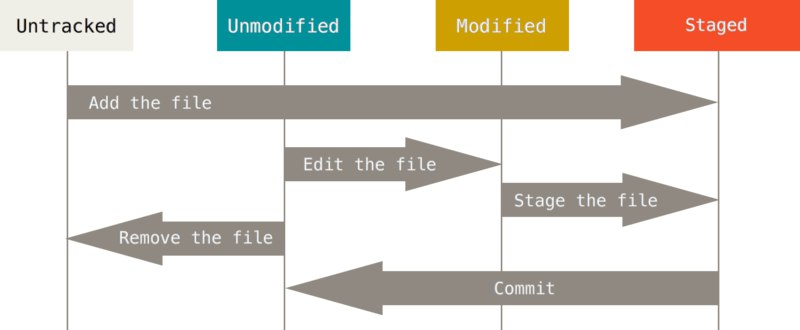

# Practica Colaborativa de Git
## Pasos a seguir en la practica de Git:
1. Armar equipos de 2 alumnos/as, Alumno A y Alumno B.
2. Alumno A hace un fork del repositorio publico en Github https://github.com/pablobots/practica-colaborativa-git
3. Alumno A agrega al Alumno B como colaborador de SU fork del repositorio
    * Alumno B debe revisar en su correo electrónico y aceptar ser colaborador.
4. Alumno A clona SU fork del repositorio a su máquina local.
    * git clone https://github.com/AlumnoA/practica-colaborativa-git
5. Alumno A abre el repositorio clonado con VSC y crea un archivo de tipo txt en su repositorio local.
6. Alumno A visualiza el estado de su repositorio.
    * Ubicarse en en la consola sobre la carpeta clonada.
        * cd "path/de/carpeta/clonada"
    * git status
7. Alumno A añade el nuevo archivo a la stagin area.
    * git add nombre-del-archivo.txt
8. Alumno A confirma los cambios.
    * git commit -m "Add file nombre-del-archivo.txt"
9. Alumno A envía los cambios a la rama principal (En Github).
    * git push
10. Ambos visualizan en Github el nuevo archivo.
11. Alumno B, que es el colaborador, clona el repositorio forkeado por su compañero a su máquina local.
    * git clone https://github.com/AlumnoA/practica-colaborativa-git
12. Alumno B visualiza el log de commits del repositorio (log).
    * Ubicarse en en la consola sobre la carpeta clonada.
        * cd "path/de/carpeta/clonada"
    * git log
13. Alumno B modifica en su maquina local el archivo que creo el Alumno A.
14. Alumno B visualiza el estado de su repositorio.
    * git status
15. Alumno B añade los cambios realizados en el archivo a la stagin area.
    * git add nombre-del-archivo.txt
16. Alumno B confirma los cambios.
    * git commit -m "Change file nombre-del-archivo.txt"
17. Alumno B envía los cambios a la rama principal (En Github).
    * git push
18. Ambos visualizan en Github los cambios realizados en el archivo.
19. Alumno A extrae los cambios que realizó el Alumnno B y los descarga en su máquina local.
    * git pull
20. Alumno A visualiza el log de commits del repositorio (log).
    * git log
21. Alumno A visualiza en su maquina local los cambios realizados en el archivo por el Alumno B.
 

## Flujo de Git:

 

## Estados de los archivos en el Working Directory (git status):

